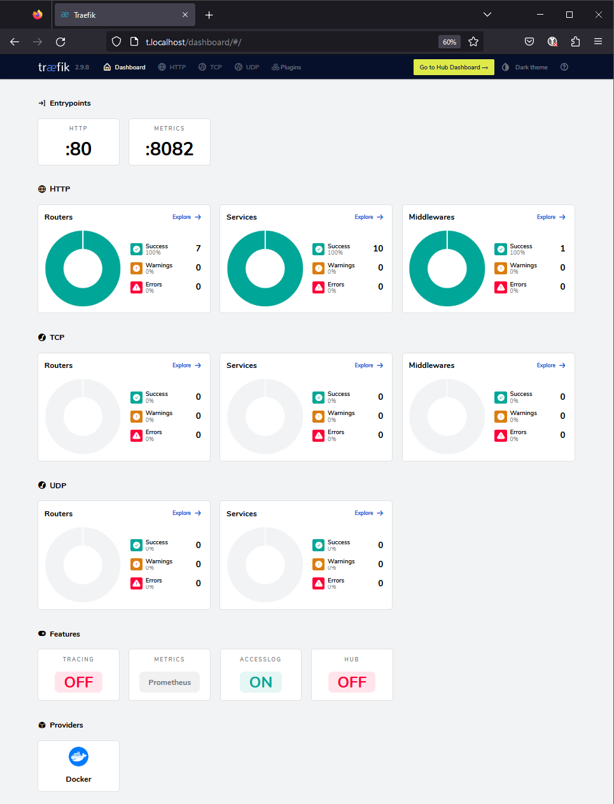
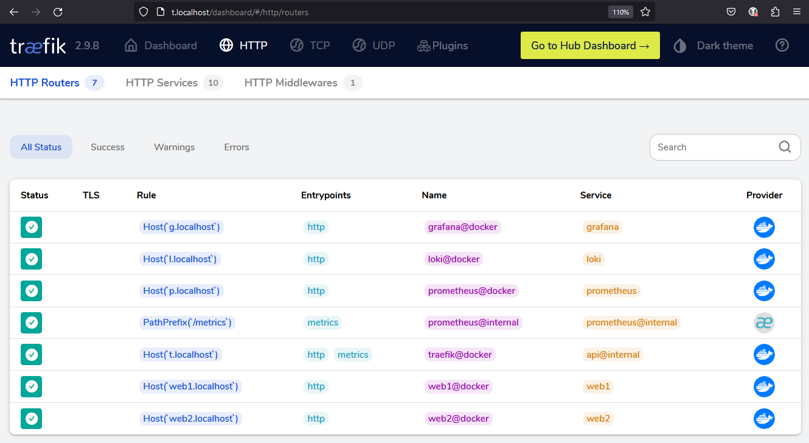
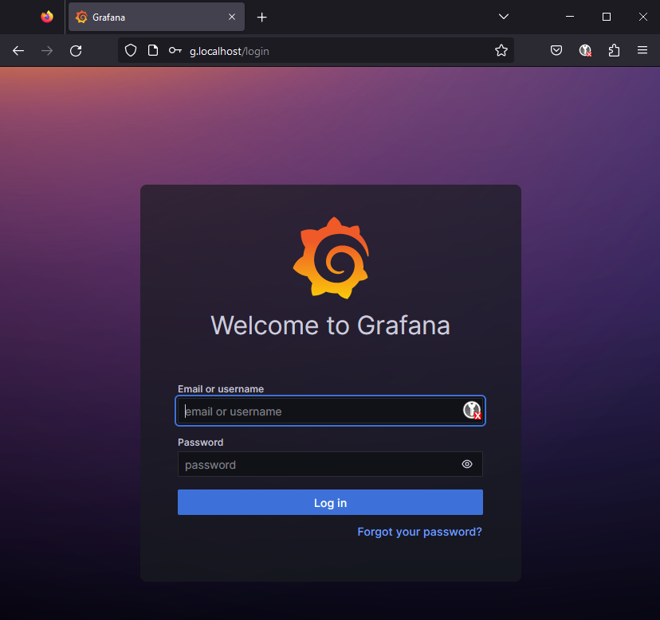
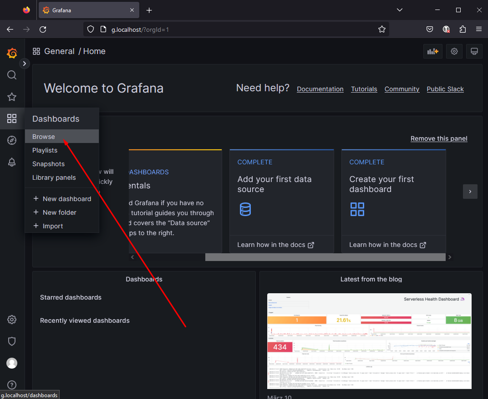
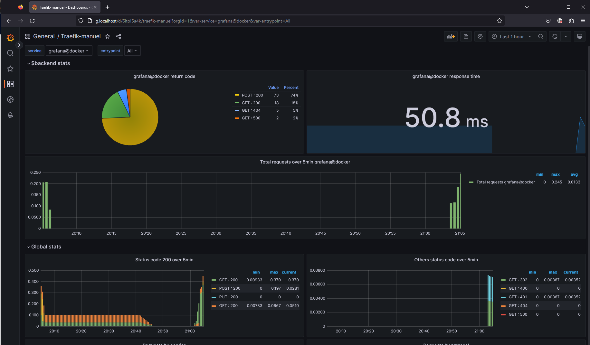
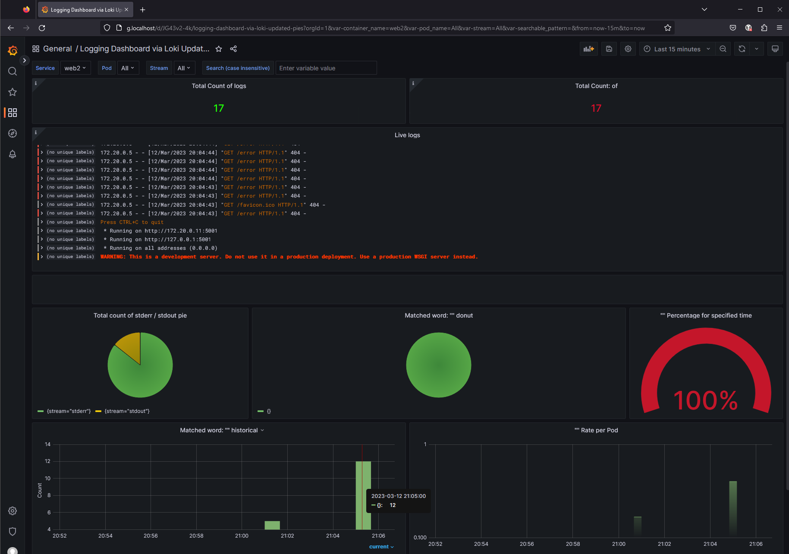
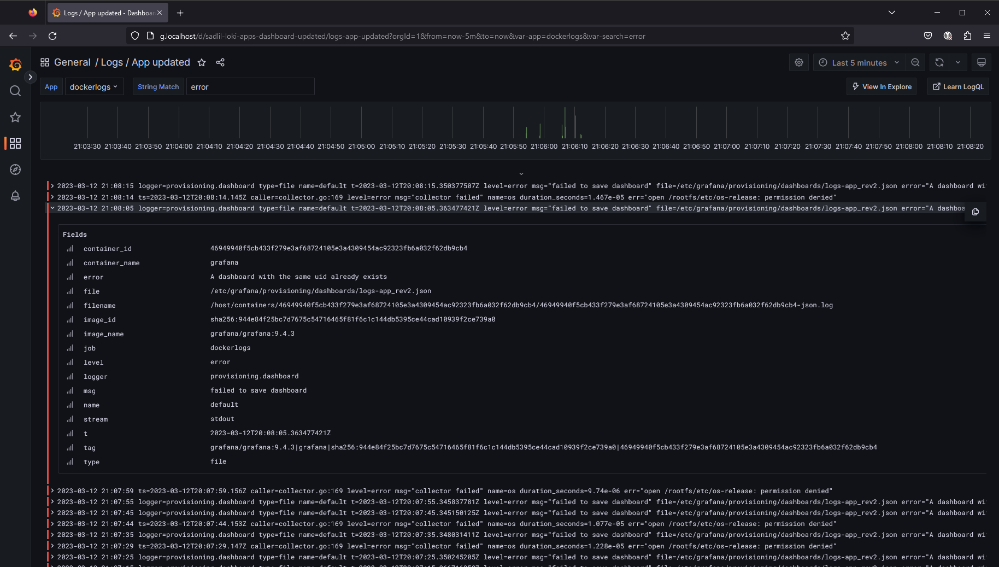
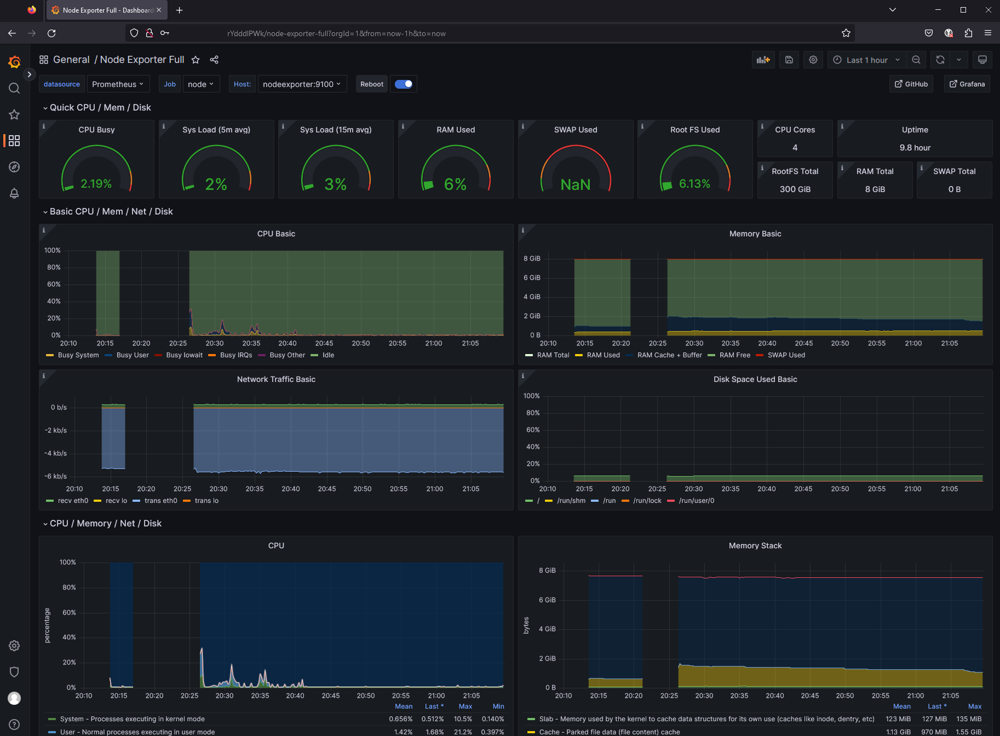

# Full featured traefik proxy with monitoring and logs

Example of a traefik proxy with monitoring and logs active using:

- node-exporter:v1.5.0
- grafana/promtail:2.7.4
- grafana/loki:2.7.4
- grafana/grafana:9.4.3
- prom/prometheus:v2.37.6
- traefik:2.9.8
- portainer/portainer-ce:2.18.3

**Note:** This is not a production ready setup. Its missing the whole HTTPS, letsencript and non-root-docker part. It is just a example of how to use traefik with monitoring and logs with all the current versions of the used tools fitting well together (what was kind of a hassle 👼).

## Installation and start

- Clone this repo
- Copy or rename the file ``example.env`` to ``.env``
- Start the infrastructure and two sample apps

```shell
docker-compose -f proxy-docker-compose.yml up -d
docker-compose -f apps-docker-compose.yml up -d
```

## Usage

- Open the traefik dashboard at <http://t.localhost> using the credentials **username**:*admin* and **password**:*admin*

- Open the grafana dashboard to see all the dashboards at <http://g.localhost> using the credentials *admin/admin*, then set a new password also with credentials *admin/admin*

- Open the sample apps at <http://web1.localhost> and <http://web2.localhost>
- Maybe create some sample data and errors for the dashboard to show by visiting <http://web1.localhost/error> and <http://web2.localhost/error>

## Credits

I used many parts from a lot of diffent souces including the documentation of most of the projects. I you feel, like i missed to mention you, please let me know.

## License: The Unlicense

This is free and unencumbered software released into the public domain.
For more information, please refer to <https://unlicense.org>

## Screenshots

**Proxy traefik:**
We see, that the modules for metrics and logs are active and see that we have 10 services running and 7 routers.


Here we see all the available routes:


**Dashboard Grafana:**
After you passed the basic-auth with *admin/admin* you can set a new password for the admin user in Grfana.


Next head to the dashboards:


Find HTTP status codes from all the services:


More on the HTTP status codes:


And find the logs of all the running docker services:


If you run this on a linux system, you can also see the system metrics:

